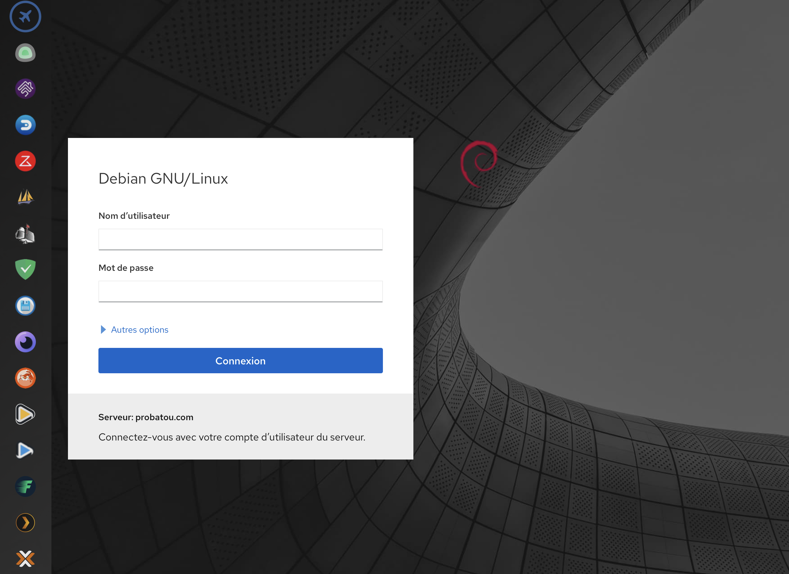

<!-- PROJECT LOGO -->
<br />
<div align="center">
  <a href="https://github.com/othneildrew/Best-README-Template">
    
  </a>
  
  <a> **WebApp** is a free and open source software application for web-ui application concentration.</a>
</div>


<!-- CURRENT FEATURES -->
## Current Features



There are many great README templates available on GitHub; however, I didn't find one that really suited my needs so I created this enhanced one. I want to create a README template so amazing that it'll be the last one you ever need -- I think this is it.

Here's why:
* Your time should be focused on creating something amazing. A project that solves a problem and helps others
* You shouldn't be doing the same tasks over and over like creating a README from scratch
* You should implement DRY principles to the rest of your life :smile:

Of course, no one template will serve all projects since your needs may be different. So I'll be adding more in the near future. You may also suggest changes by forking this repo and creating a pull request or opening an issue. Thanks to all the people have contributed to expanding this template!

Use the `BLANK_README.md` to get started.

<p align="right">(<a href="#top">back to top</a>)</p>


<!-- GETTING STARTED -->
## Getting Started

This is an example of how you may give instructions on setting up your project locally.
To get a local copy up and running follow these simple example steps.

### Prerequisites

This is an example of how to list things you need to use the software and how to install them.
* MariaDB
  ```sh
  apt install mariadb-server
  ```
  
* PHP
  ```sh
  apt install php7.4
  ```

### Installation

_Below is an example of how you can instruct your audience on installing and setting up your app. This template doesn't rely on any external dependencies or services._

1. Clone the repo
   ```sh
   git clone https://github.com/ProBatou/WebApp.git
   ```
2. Go to directory
   ```sh
   cd WebApp/html
   ```
3. Run installer
   ```sh
   ./installer.sh
   ```
4. Remove github repo
   ```sh
   rm -r ../../WebApp
   ```
5. Go to you're favorite browser and configure WebApp
   ```html
   https://[IPOFDEVICEE]/install.php
   ```
6. Enjoy and add App in interface
  
  

<p align="right">(<a href="#top">back to top</a>)</p>


<!-- USAGE EXAMPLES -->
## Usage

Use this space to show useful examples of how a project can be used. Additional screenshots, code examples and demos work well in this space. You may also link to more resources.

_For more examples, please refer to the [Documentation](https://example.com)_

<p align="right">(<a href="#top">back to top</a>)</p>


<!-- CONTACT -->
## Contact

Your Name - [@your_twitter](https://twitter.com/your_username) - webapp@probatou.com

Project Link: [https://github.com/your_username/repo_name](https://github.com/ProBatou/WebApp)
