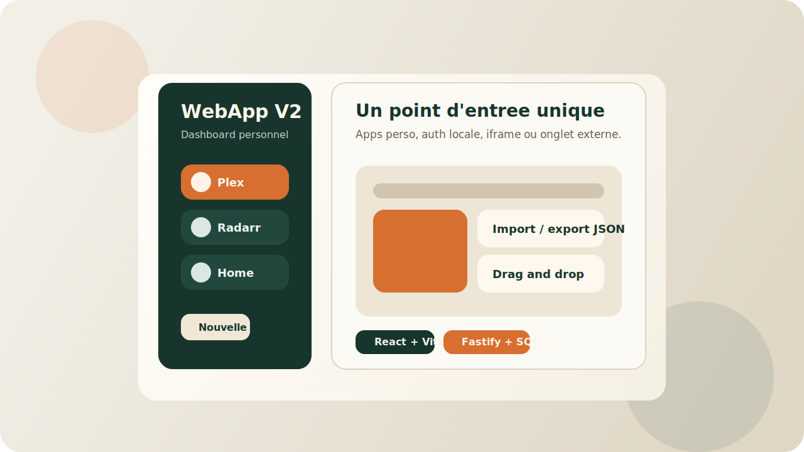

# WebApp V2

WebApp est un agregateur d'applications web personnel. Cette V2 remplace l'ancienne base PHP/JavaScript par un monorepo TypeScript avec un frontend React/Vite et une API Fastify.



## Apercu

WebApp centralise tes services dans une interface unique avec :

- authentification par session HTTP only
- ouverture des apps en iframe ou dans un onglet externe
- reorganisation par glisser-deposer
- import et export JSON
- stockage local SQLite
- deploiement simple en local ou via Docker/Cosmos

## Stack

- Frontend : React 19 + Vite + TypeScript
- Backend : Fastify 5 + TypeScript
- Base de donnees : SQLite
- Validation : Zod
- Auth : cookies httpOnly + sessions serveur
- Workspace : npm workspaces

## Prerequis

- Node.js >= 20
- npm

## Installation

```bash
git clone https://github.com/ProBatou/WebApp.git
cd WebApp
npm install
npm run build
```

## Developpement local

```bash
npm run dev
```

Services disponibles :

- Frontend : `http://localhost:5173`
- API : `http://localhost:3001`
- Healthcheck API : `http://localhost:3001/api/health`

## Build de production

```bash
npm run build
```

Le build frontend est genere dans `apps/web/dist/`.

## Docker

Le projet peut etre lance avec le `docker-compose.yml` fourni :

```bash
docker compose up -d
```

Le service :

- monte le projet dans `/app`
- reinstalle les dependances si necessaire
- build le frontend et l'API au demarrage
- expose l'application sur `http://localhost:3004`
- utilise le healthcheck `GET /api/health`

## Cosmos

Le fichier `cosmos-service.json` est fourni pour un deploiement Cosmos direct.

Chemins utilises :

- code : `/cosmos-storage/webapp-v2`
- base SQLite : `/app/data/webapp-v2.db`

## Structure

```text
apps/
  api/
  web/
package.json
package-lock.json
tsconfig.base.json
docker-compose.yml
start.sh
cosmos-service.json
```

## Donnees

- la base SQLite locale est creee automatiquement dans `apps/api/data/`
- les fichiers `*.db` sont ignores par Git
- l'API expose un endpoint de sante sur `/api/health`

## Version legacy PHP

L'ancienne version PHP reste accessible dans :

- la branche `php-legacy`
- le tag `php-legacy`

## Demo

Il n'y a pas de demo publique embarquee pour le moment. Le mode le plus simple pour tester le projet reste :

```bash
npm install
npm run dev
```

## Licence

Ce projet conserve le fichier `LICENSE` du depot d'origine.
