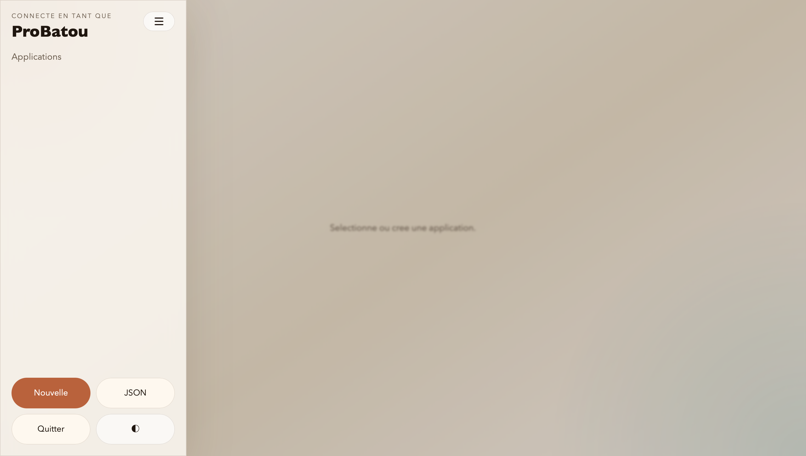

# WebApp

> Ton homelab, une seule page.

Tu as Plex, Nextcloud, Grafana, Home Assistant, Portainer... et tu passes ta vie a retaper des URLs ou a fouiller dans tes bookmarks ? **WebApp** rassemble tout dans une interface claire, accessible depuis n'importe quel appareil sur ton reseau.



[](https://webapp-latest-mk9k.onrender.com)
[](https://ghcr.io/probatou/webapp)
[](./LICENSE)
[](https://github.com/ProBatou/WebApp/releases)

---

## Voir la demo

👉 **[webapp-latest-mk9k.onrender.com](https://webapp-latest-mk9k.onrender.com)**

Login : `Administrator`  
Mot de passe : `Administrator`

> Le serveur peut mettre ~30 secondes a demarrer s'il est en veille.

---

## Ce que ca fait

- **Toutes tes apps au meme endroit** : affichage en iframe integree ou ouverture dans un onglet externe
- **Rafraichissement individuel** : recharge une app sans recharger toute la page
- **Glisser-deposer** : reorganise les apps librement
- **Import / export JSON** : sauvegarde ou restaure ta configuration facilement
- **Theme clair / sombre** : bascule selon tes preferences
- **Sidebar compacte** : maximise l'espace disponible pour le contenu
- **Authentification par session** : cookie HTTP-only, sans JWT expose cote client

---

## Demarrage rapide

### Docker

Methode recommandee pour un usage normal.

```bash
docker run -d \
  --name webapp \
  -p 3004:3004 \
  -v ./data:/app/data \
  ghcr.io/probatou/webapp:latest
```

Ouvre ensuite `http://localhost:3004` et cree ton compte.

### Exemple `docker-compose.yml`

```yaml
services:
  webapp:
    image: ghcr.io/probatou/webapp:latest
    container_name: webapp
    ports:
      - "3004:3004"
    volumes:
      - ./data:/app/data
    restart: unless-stopped
```

### Developpement local

```bash
git clone https://github.com/ProBatou/WebApp.git
cd WebApp
npm install
npm run dev
```

Services disponibles :

- Frontend : `http://localhost:5173`
- API : `http://localhost:3001`

---

## Deploiement Cosmos

Le depot contient aussi une configuration dediee a Cosmos avec `cosmos-service.json`.
Cette configuration utilise directement l'image Docker GHCR publiee.
Pour eviter les problemes de permissions sur les bind mounts Cosmos, ce service s'execute en root uniquement dans ce contexte.

Configuration utilisee :

```text
image : ghcr.io/probatou/webapp:latest
data  : /cosmos-storage/webapp-v2/data -> /app/data
db    : /app/data/webapp.db
user  : root (compatibilite bind mount Cosmos)
port  : 3004
```

---

## Variables d'environnement

### Image Docker GHCR

| Variable | Defaut | Description |
|----------|--------|-------------|
| `PORT` | `3004` | Port d'ecoute du serveur |
| `DATABASE_PATH` | `/app/data/webapp.db` | Chemin vers la base SQLite |
| `NODE_ENV` | `production` | Environnement Node |

### Developpement local

Par defaut :

- l'API ecoute sur `3001`
- la base SQLite est creee dans `apps/api/data/webapp-v2.db`

---

## Stack

| Couche | Techno |
|--------|--------|
| Frontend | React 19 + Vite + TypeScript |
| Backend | Fastify 5 + TypeScript |
| Base de donnees | SQLite via `better-sqlite3` |
| Validation | Zod |
| Auth | Sessions serveur + cookies HTTP-only |
| Monorepo | npm workspaces |

---

## Images Docker disponibles

```bash
ghcr.io/probatou/webapp:latest
ghcr.io/probatou/webapp:1.0.0
ghcr.io/probatou/webapp:1.0
```

Support de `linux/amd64` et `linux/arm64` pour Raspberry Pi, NAS et Apple Silicon.

---

## Historique

WebApp existe depuis une premiere version en PHP/SQLite.
La v2 est une reecriture complete en TypeScript avec un monorepo, une API Fastify et une interface React moderne.

L'ancienne version reste disponible :

- branche : `php-legacy`
- tag : `php-legacy`

---

## Contribuer

Les issues et PR sont les bienvenues.

---

## Licence

[Apache 2.0](./LICENSE)
